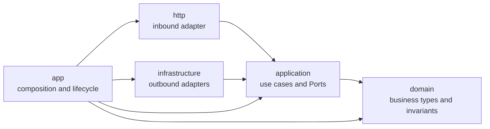

# Architecture

The workspace follows Clean Architecture's dependency rule: source dependencies point toward business policy, while runtime calls cross external boundaries through Application-owned Ports.

`http` and `infrastructure` are sibling adapters. HTTP may invoke a use case that reaches MySQL at runtime, but it sees only an Application Port. `app` is the only crate that imports and connects both adapters.

| Crate | Owns | Must not own |
|---|---|---|
| `domain` | business types, entities, invariants, pure behavior | I/O, Ports, serialization, framework types |
| `application` | use cases, Ports, stable workflow and dependency failure categories | HTTP status, SQLx/reqwest details, process configuration |
| `http` | Router, request/response DTOs, extractors, middleware, public errors | concrete repositories/clients or business decisions |
| `infrastructure` | MySQL, migrations, downstream HTTP and concrete failure classification | routes or business orchestration |
| `app` | commands, settings, concrete wiring, telemetry setup and lifecycle | handlers, SQL, Domain rules |

Cargo manifests and `just architecture` mechanically protect the crate graph and forbid outer framework dependencies in inner crates. Fresh review checks semantic ownership that dependency analysis cannot prove: thin handlers, Application-owned Ports, adapter-private representations, Domain-owned invariants, and one real composition path.

The root `AGENTS.md` contains only this responsibility map, trust boundaries, stack authority and verification expectations. The production code and tests are the primary examples; read the Guide only for a concrete unanswered design question.

There is no `utils`, `common`, or `shared` architecture layer. Put a business concept in its innermost owner, express required external behavior as an Application Port, and keep representation conversion in the adapter that owns the representation.

See [Project structure](project-structure.md), [Ports and adapters](ports-and-adapters.md), and [Error handling](error-handling.md).
