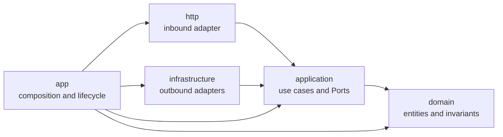

# Architecture

The workspace uses Clean Architecture's dependency rule: source code points toward business policy, while runtime control may cross adapters through application-owned Ports.

`http` and `infrastructure` are siblings. An Axum handler may invoke a use case that calls a MySQL repository at runtime, but the HTTP crate sees only the `TaskRepository` Port. The `app` crate is the only place that imports and connects both adapters.

The compile-time graph and runtime call direction are different views of the same system. Source dependencies continue pointing inward while an application use case calls outward through a Port it owns. The outer adapter implements that capability without becoming visible to the use case or HTTP adapter.

The executable host lives at root `app/`, beside `crates/`, because it owns the process boundary rather than an architectural layer. A generated service should introduce `apps/` only when it gains a second real executable host.

| Crate | Owns | Does not own |
|---|---|---|
| `domain` | Task, Task ID, Task Title, invariants | I/O, Ports, serialization |
| `application` | CreateTask, Ports, stable failure categories | HTTP status, SQLx/reqwest details |
| `http` | Router, DTOs, extractors, public errors, inbound spans | concrete repositories or clients |
| `infrastructure` | MySQL, migrations, reqwest TaskPolicy | routes or business orchestration |
| `app` | settings, wiring, commands, Logforth/fastrace, lifecycle | handlers, SQL, domain rules |

There is no `utils`, `common`, or `shared` layer. Put a shared business concept in its innermost owner, express external behavior as an application Port, and keep conversions at adapter boundaries. Depending on the same small crate from multiple layers is preferable to inventing a wrapper. Add a shared capability crate only after several real callers reveal one stable responsibility.

Cargo manifests mechanically enforce the crate graph. Root and crate-local `AGENTS.md` files cover placement and data-boundary rules that Cargo cannot express.

See [Project structure](project-structure.md) for the fixed workspace layout and file-placement guidance.
See [Ports and adapters](ports-and-adapters.md) for Port ownership, Domain Service boundaries, static dispatch, and the optional dynamic-dispatch path.
See [Error handling](error-handling.md) for typed failure ownership, cross-layer conversion, public responses, and safe operational recording.
