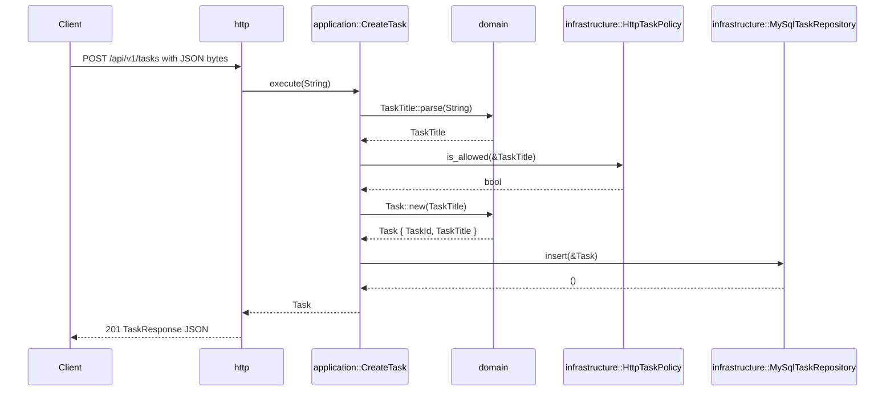

# Task flow

`CreateTask` is the generated service's canonical vertical-slice example, not an exhaustive catalogue of installed routes. It is deliberately create-only: a Task has a generated ULID and a normalized title, with no status, listing, update, deletion, outbox, or idempotency claim. The complete route catalogue lives in [Routing and handlers](http/routing-and-handlers.md#installed-routes).

The same business value changes representation at each boundary. Similar field names do not make the surrounding types interchangeable.

## Composition before requests

`app` is the only place that knows the concrete adapters. During startup, [`app::build`](../../app/src/lib.rs) performs this composition:

```text
SecretString database URL
    → exposed &str at the connection boundary
    → MySqlPool
    → MySqlTaskRepository + MySqlReadinessProbe

String policy URL + timeout
    → validated reqwest::Url + Client
    → HttpTaskPolicy

HttpTaskPolicy + MySqlTaskRepository
    → CreateTask<P, R>
    → HttpState<P, R, H>
    → FromRef → TaskState<P, R> or HealthState<H>
    → Axum Router
```

HTTP receives the configured use case and readiness capability through generic Application Ports. Its aggregate state remains private; each handler extracts only its Task or Health capability substate. HTTP never sees `MySqlPool`, reqwest `Client`, database credentials, or concrete adapter errors.

## CreateTask control flow



The example touches every layer because its purpose is to prove the architecture. A later feature touches only the layers its behavior actually needs.

## Successful type transformations

| Boundary | Input | Conversion owner | Output |
|---|---|---|---|
| Request body | HTTP bytes and headers | Axum `Json` plus HTTP [`ApiError`](../../crates/http/src/errors/mod.rs) rejection conversion | `CreateTaskRequest { title: String }` |
| HTTP to Application | `CreateTaskRequest` | HTTP handler | owned `String` |
| Application to Domain | `String` | [`CreateTask`](../../crates/application/src/use_cases/create_task.rs) calling `TaskTitle::parse` | valid `TaskTitle` |
| Application to Policy Port | `&TaskTitle` | Application use case | `TaskPolicy::is_allowed` call |
| Policy Port to downstream HTTP | `&TaskTitle` | `HttpTaskPolicy` | private `PolicyRequest<'_>` serialized as JSON |
| Downstream HTTP to Policy result | response bytes and status | `HttpTaskPolicy` | private `PolicyResponse`, then `bool` |
| Domain creation | `TaskTitle` | `Task::new` | `Task { TaskId, TaskTitle }` |
| Application to Repository Port | `&Task` | Application use case | `TaskRepository::insert` call |
| Repository Port to SQL | `&Task` | `MySqlTaskRepository` | ID `String` and title `&str` bind values |
| SQL to MySQL | bind values | SQLx | `CHAR(26)` ID and `VARCHAR(200)` title |
| Application to HTTP | `Task` | [`From<Task> for TaskResponse`](../../crates/http/src/dtos/task.rs) | `TaskResponse { id: String, title: String }` |
| Response body | `TaskResponse` | HTTP Serde boundary | JSON bytes |

The central distinction is intentional:

```text
raw String
    ≠ valid TaskTitle
    ≠ downstream PolicyRequest
    ≠ SQL bind values
    ≠ public TaskResponse
```

Each conversion stays with the boundary that owns the destination representation. Domain never derives Serde for adapter convenience, and Infrastructure never exports its private request or persistence representation inward.

## Failure transformations

Concrete failures become less detailed as they move inward or toward the public boundary. The layer that understands a concrete dependency classifies it before returning.

| Origin | Boundary conversion | Application category | Public response |
|---|---|---|---|
| unknown route | Router fallback → `ApiError::NotFound` | none | `404 not_found` |
| unsupported method | Router method fallback → `ApiError::MethodNotAllowed` | none | `405 method_not_allowed` |
| malformed JSON or unknown field | Axum rejection → `ApiError::InvalidRequest` | none | `400 invalid_request` |
| missing/wrong content type | Axum rejection → `ApiError::UnsupportedMediaType` | none | `415 unsupported_media_type` |
| body over 8 KiB | Axum rejection → `ApiError::RequestTooLarge` | none | `413 request_too_large` |
| `TaskTitle::parse` failure | `TaskTitleError` → `CreateTaskError::InvalidTitle` | `InvalidTitle` | `422 task_title_invalid` |
| Policy returns `allowed: false` | bool → `CreateTaskError::PolicyRejected` | `PolicyRejected` | `422 task_policy_rejected` |
| reqwest failure, 429, or downstream 5xx | concrete failure → `TaskPolicyError::Unavailable` | `PolicyUnavailable` | `503 task_policy_unavailable` |
| non-200 success-path status or malformed Policy JSON | concrete failure → `TaskPolicyError::BadResponse` | `PolicyBadResponse` | `502 task_policy_bad_response` |
| SQLx insert failure | `sqlx::Error` → `TaskRepositoryError` | `Persistence` | `500 internal_error` |

[`ApiError`](../../crates/http/src/errors/mod.rs) is the only status-code and public-envelope authority. Domain and Application errors contain no HTTP types. Infrastructure may log a safe failure category, but raw SQLx/reqwest errors, SQL, URLs, titles, bodies, headers, and credentials never cross the boundary or enter the response.

See [Error handling](architecture/error-handling.md) for the reusable rules behind these Task-specific mappings.

Failure also short-circuits work:

- invalid title performs no Policy request and no insert;
- Policy rejection or failure performs no insert;
- persistence failure returns no partial Task response;
- no failure path changes the fixed public error envelope.

## Transformations intentionally absent

The template does not create structures merely to resemble a generic architecture example:

- the insert returns no database row, so there is no `TaskRow`, hydration method, or row-to-Domain mapper;
- Domain performs no serialization or deserialization;
- HTTP DTOs never enter Application Ports or Infrastructure;
- SQLx and reqwest errors never enter Application or Domain;
- the external Policy call completes before the insert, so no database transaction spans network I/O;
- there is no shared request/response model used across boundaries;
- there is no transaction, retry, idempotency key, or outbox in the one-write create flow.

Add one of these only when a real behavior creates the corresponding responsibility. For example, a future read path must reconstruct Domain values through invariant-preserving constructors rather than reusing the HTTP response type as a database row.

## Verification by boundary

| Evidence | What it proves |
|---|---|
| Domain tests beside `TaskTitle` and `Task` | invariant parsing, normalization, ULID identity, and valid construction |
| Application tests beside `CreateTask` | validation → Policy → persistence ordering and failure short-circuiting |
| HTTP tests through the installed Router | DTO extraction, limits, response conversion, and fixed public error mapping |
| Infrastructure policy test | client settings reject invalid URL schemes and zero timeout at startup |
| [`app/tests/create_task.rs`](../../app/tests/create_task.rs) | production composition with real MySQL, an HTTP Policy stub, persistence, and the installed Router |
| `just verify` | migration, live process, health routes, outbound propagation, Task HTTP behavior, and graceful shutdown |

Use the `add-endpoint` Skill when extending this slice. It starts from these owners and conversions, but it does not require every new behavior to reproduce the entire chain.
